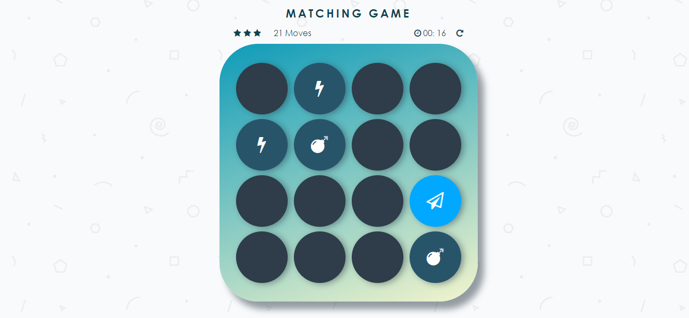
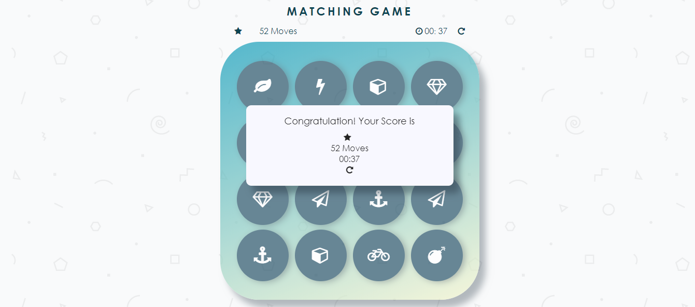

# Memory Game Project

## How to play

- The objective is to collect all pairs of cards. The game randomly shuffles the cards. 
- The player turns over any two cards and the interface will keeps them opened if the cards match.
- When the player turns over two cards that do not match, those cards are turned face down again (in the same position).
- The trick is to remember which cards are where.
- The player wins once all cards have successfully been matched.

### Screenshots

### Special Features

- When the player starts a game, a displayed timer also start. Once the player wins the game, the timer stops.

- The game displays a star rating (from 1 to 3) that reflects the player's performance. At the beginning of a game, it displays 3 stars. After 30 moves, it will change to 2 stars rating. After 40 moves, it will change to a 1 star rating.

## Resources  

- Udacity
- jQuery
- jQuery UI 
- Font Awesome <https://fontawesome.com/>
- Google Fonts <https://fonts.google.com/>

